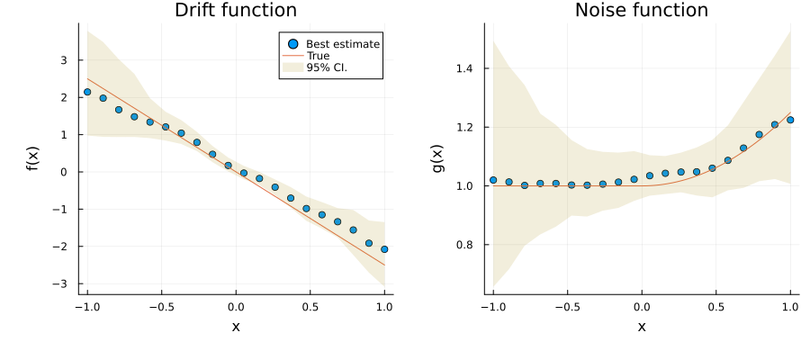

```julia
]dev ExponentialNoiseSDE
```

       Resolving package versions...
      No Changes to `~/Documents/Julia/test-ExponentialNoiseSDE/Project.toml`
      No Changes to `~/Documents/Julia/test-ExponentialNoiseSDE/Manifest.toml`


```julia
]status
```

    Status `~/Documents/Julia/test-ExponentialNoiseSDE/Project.toml`
      [e05663f3] ExponentialNoiseSDE v0.1.0 `~/.julia/dev/ExponentialNoiseSDE`
      [91a5bcdd] Plots v1.38.11


```julia
using ExponentialNoiseSDE
using DelimitedFiles
using Plots
using Plots.Measures
```


```julia
filename = "/Users/w1davis/.julia/dev/ExponentialNoiseSDE/test/data/exampleData.txt"

X_data = DelimitedFiles.readdlm(filename)[:]
N_data = length(X_data)
obs = Observation(
    X_data,
    0.0050
);
```


```julia
plot(X_data[1:10000])
```


    

    


```julia
## Conditional moment settings
nTimeShiftSamplePoints = 15
nEvalPoints = 20
xEvalLims = (-1.0,1.0)
kernel = "Epanechnikov"
bandwidth = 0.1

# Variables/attributes
timeShiftSamplePoints = collect(1:nTimeShiftSamplePoints)
momentSize = (nTimeShiftSamplePoints, nEvalPoints)

momentSettings = ConditionalMomentSettings(
    timeShiftSamplePoints,
    nEvalPoints,
    xEvalLims,
    kernel,
    bandwidth,
);
```


```julia
conditionalMoments = build_moments(obs, momentSettings);
```


```julia
modelSettings1 = ModelEstimateSettings(displayOutputFlag=false)

# Estimating
modelEstimate = estimate_model(conditionalMoments, modelSettings1);
```


```julia
bootstrapSettings1 = BootstrapSettings(nSamples=200)

bootstrapStatistics = estimate_bootstrap_statistics(modelEstimate,bootstrapSettings1);
```

    Starting correlated process regression and bootstrap iterations
    Sample: 1
    Sample: 2
    ...
    Sample: 199
    Sample: 200


## Plotting


```julia
x = modelEstimate.conditionalMoments.xEvalPoints

drift_true(x) = -2.5*x
noise_true(x) = x > 0 ? 1 + x^2/4 : 1
;
```


```julia
p1 = scatter(x,modelEstimate.driftEstimate,label="Estimate")
plot!(drift_true,label="True")
plot!(title="Drift function")
plot!(xlabel="x")
plot!(ylabel="f(x)")

p2 = scatter(x,modelEstimate.noiseEstimate,label="")
plot!(noise_true,label="")
plot!(title="Noise function")
plot!(xlabel="x")
plot!(ylabel="g(x)")
plot!(ylim=(0.75,Inf))

plot(p1,p2,size=(900,400))
```


    

    


```julia
lower_b(var) = var[:percentiles95] .|> first
upper_b(var) = var[:percentiles95] .|> last
;
```


```julia
p1 = scatter(x,modelEstimate.driftEstimate,label="Best estimate")
plot!(drift_true,label="True")
plot!(x, 
    lower_b(bootstrapStatistics.driftEstimate), 
    fillrange = upper_b(bootstrapStatistics.driftEstimate), 
    linealpha = 0.0, color=5, fillalpha = 0.15, label = "95% CI."
)
plot!(title="Drift function")
plot!(xlabel="x")
plot!(ylabel="f(x)")

p2 = scatter(x,modelEstimate.noiseEstimate,label="")
plot!(noise_true,label="")
plot!(x, 
    lower_b(bootstrapStatistics.noiseEstimate), 
    fillrange = upper_b(bootstrapStatistics.noiseEstimate), 
    linealpha = 0.0, color=5, fillalpha = 0.15, label = ""
)
plot!(title="Noise function")
plot!(xlabel="x")
plot!(ylabel="g(x)")

plot(p1,p2,size=(900,400),bottom_margin = 10mm,left_margin = 10mm)
```


    

    


```julia

```
